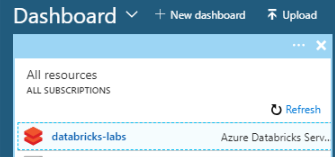
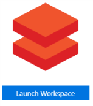
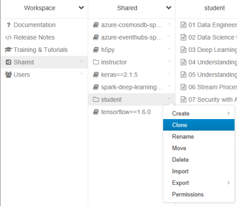
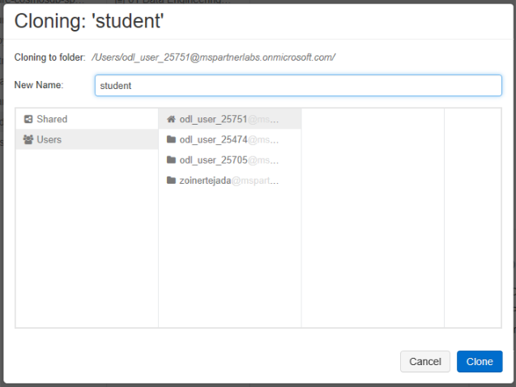
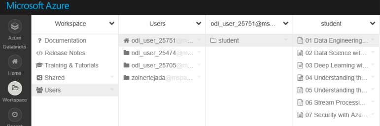

# Azure Databricks Lablets

This repository contains a series of short labs that take about 10 minutes to complete each, we like to call them lablets.

## Lab Quickstart (pre-provisioned environment)
Once you receive your login to your Azure Subscription, follow these steps:

Visit the [Azure Portal](https://portal.azure.com) and login with the credentials provided. 

From the Dashboard, look in All Resources and select the `databricks-labs` service. 

Within the Azure Databricks Service instance, select `Launch Workspace`.

Select the Workspace tab on the left, and then choose shared. 

Right-click on the student folder and select clone.

In the Cloning dialog, set New Name to `student` and select Users and your home directory (the item with the house icon). Select clone.

From the Workspace, select Users, your user and then select the student folder that you just created. You will see all of the available labs listed. You can start with any one of them.

Within each lab, follow the instructions. Remember to run a cell you can press shift+enter when it has focus, or you can press the play icon in the top right corner of each cell. For each of the labs you should select and attach to the [labs-standard] cluster to run your code, which you can select by using the deatached/attached dropdown in the top left corner of your notebook.  

## Using these Labs in your own Azure Subscription
These labs are intended to be used within a pre-provisioned lab environment, but you can download them and use these labs in your own Azure subscription. Just follow the instructions in the Setup folder of this repo. 